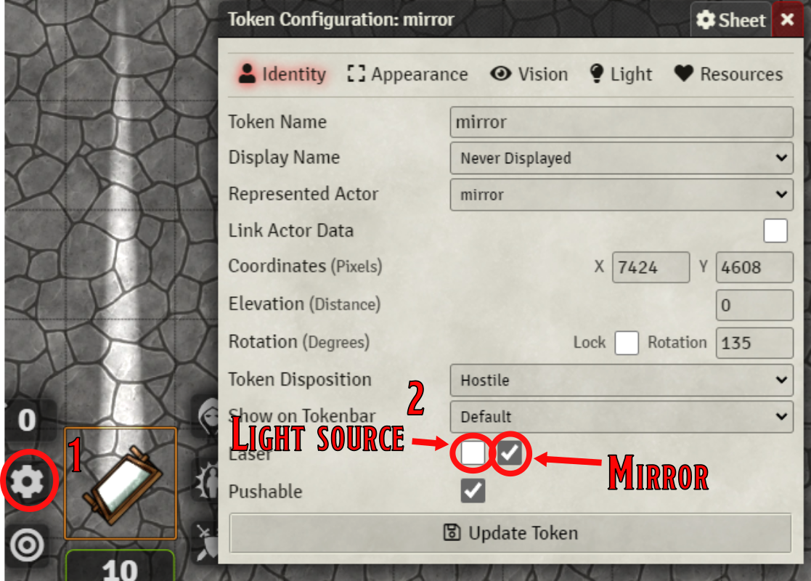

# lasers
FoundryVTT module for lasers, or light-beams that can be reflected using mirrors. This preliminary beta version implements mirrrors and light sources that interact with each other.
Both the mirrors and lightsources are tokens, and they are thus compatible with pushable tokens.

## Help:
 * Create a token that has the image of your desired light source. The image must be rotated so that the light comes out in the down direction. 
 * Edit the token (1), and in the configuration click the leftmost of the two checkboxes (2), to indicate that this is your light.
 * Create another token, and choose an image of a mirror. The reflecting side should also point downward.
 * Edit the token (1), and select the rightmost checkbox, denoting this as a mirror.
 * Rotate tokens, to your desired position, or better yet, install Monks Active tiles, and create buttons that your players can interact with.

The players does not need to have permissions to any of the tokens. If you install ["pushable"](https://github.com/oOve/pushable) tokens your players can push the mirrors or light-sources around.

The light tokens will create multiple extra light tokens that act as each reflection. It can happen that the light looses them instead of deleting them automatically. If they do, you can manually select and delete them. The image for the reflecting light token is 💢 . If you wish to change this default image, you'l find it in the module's folder under media.

Both the light source and the mirrors create a small wall behind them. This wall will be rotated and moved along with the token (and deleted when the token is deleted). It may happen that these walls are left behind, in that case, manually delete them.

## TODO:
 * Implemnent support for Monks Active tiles, so that light beams can trigger them. As far as today, there is no interaction outside this module of the lightbeams. 
 * The current version use Foundry's default light, or beams that are a slice of a circular (pie slices) light model. Future implementation should introduce paralell beams of light.
 * Colored lights, and the possibility for filters, that change the color of the light along its path.
 * Probably bug-fixing

