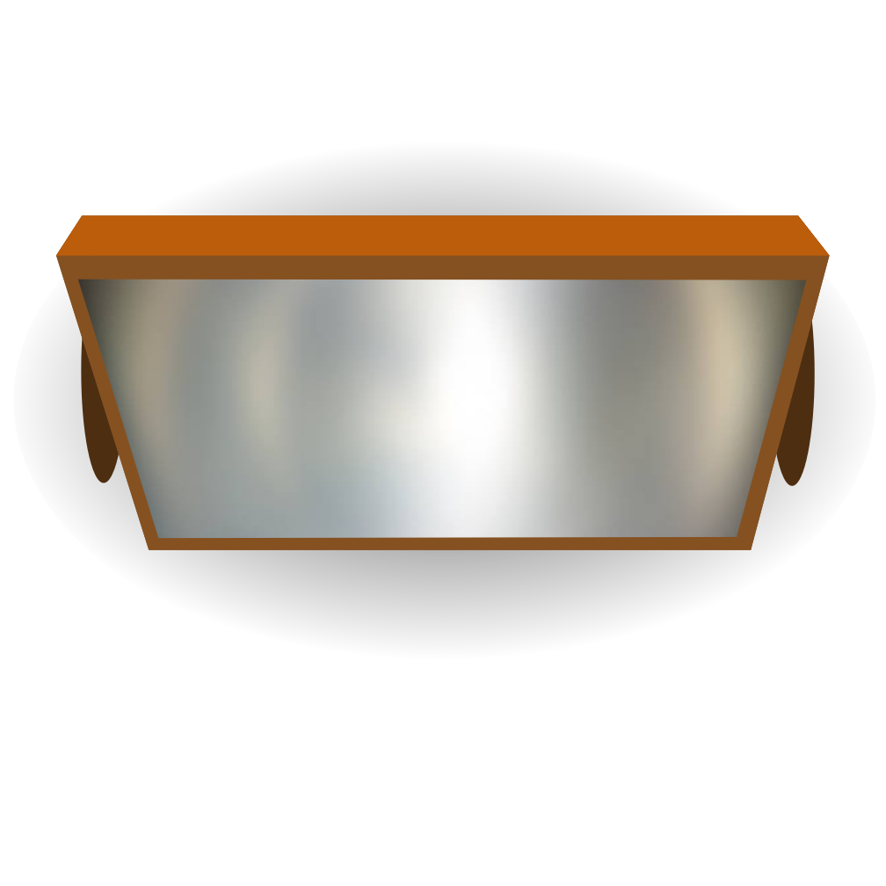

# Lasers - Light-beams and Mirrors
FoundryVTT module for lasers, or light-beams that can be reflected using mirrors. This version implements mirrrors, light sources, prisms and sensors that interact with each other. All these "tools" are tokens, that can be rotated and moved as usual.

## Laser tools
 *  **The lasers**, these output light in its rotation heading. The light can be colored, animated and configured in the token settings.
 *  **The Mirror** This will reflect light (like a normal mirror) from its front side, and block light from its back.
 *  **The Sensor** This token will detect when light hits it. It can be configured to run a macro every time the number of lights shining on the sensor changes. E.g., from 0 to 1, 2-3 or 1 to zero. If you set up the sensor to emit light, the sensor will turn off that light when it reaches zero lights, and light it up again when it gets above one. The name of the macro that will be executed can be set under token config (3).
 *  **The Prism** This token will take light in from any angle, and output in a single direction. This can e.g., be used to collect light of multiple colors, and direct them all out in a single beam.

All the tools above are available in the compendium named *Laser Tools*.

## Creating Tools from scratch:
 * Create a token that has the image of your desired tool. The image must be rotated so that the light comes out in the down direction, whether this is the front of the mirror, the source of the laser. 
 * Edit the token (1), and in the configuration click the checkbox (2) that matches the tool you wish to create.
 * If you created a lamp, you can edit its light settings under the light tab. Remember to set the light output angle quite narrow, e.g. 5 degrees..
 * If you created a sensor, you can set the name of the macro it will execute to the right (3). This macro name must match the name of an existing macro.
 * Rotate tokens, to your desired position, or better yet, install Monks Active tiles, and create buttons that your players can interact with.


The players does not need to have permissions to any of the tokens. If you install ["pushable"](https://github.com/oOve/pushable) tokens your players can push the mirrors or light-sources around.

The light tokens will create multiple extra light tokens that act as each reflection. It can happen that the light looses them instead of deleting them automatically. If they do, you can manually select and delete them. The image for the reflecting light token is 💢. If you wish to change this default image, you'l find it in the module's folder under media.

All tokens have a field next to the sensor checkbox that enables you to enter the name of a macro. This macro will be called every time the number of lights change on this sensor. Below is a example macro that prints out some information.
```JS
console.warn(token);
let activelights = token.document.getFlag('lasers', 'active_lights');
console.log(activelights);
if (activelights.length>0){
  // Do something exciting
  console.log("Exciting things here!");
}
```
### Monks Active Tiles
The sensor can also trigger Monks Active tiles. The sensor will trigger all Active Tiles that contains it. Below is a simple trigger that only shows a dialog after three lights shines on it. The "current tokens" in the triggered tile will point to the lasers that currently shine on the sensor.


Both the light source and the mirrors create a small wall behind them. This wall will be rotated and moved along with the token (and deleted when the token is deleted). It may happen that these walls are left behind, in that case, manually delete them.

## TODO:
 * Probably bug-fixing, still some issues with copying and pasting objects. Also interacting too fast with the lights can introduce some un-intended race conditions.


Do you like this module?; then please support me at [Patreon](https://www.patreon.com/drO_o).

Would you like to show off your creations or ask questions about the module feel free to drop in at my [discord channel](https://discord.gg/5CCAhsKFDp). 
